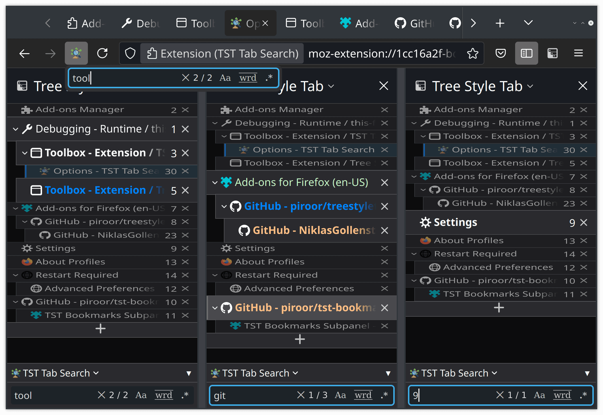
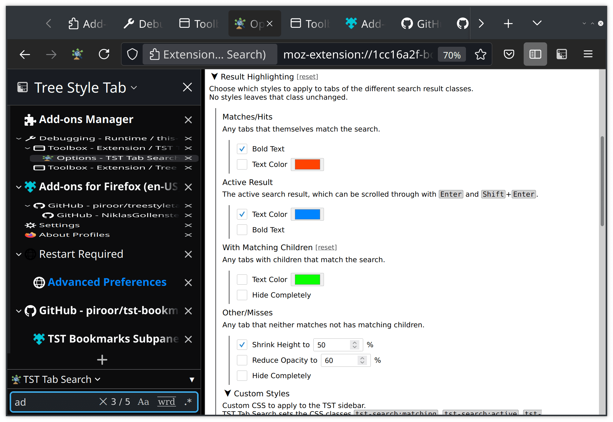
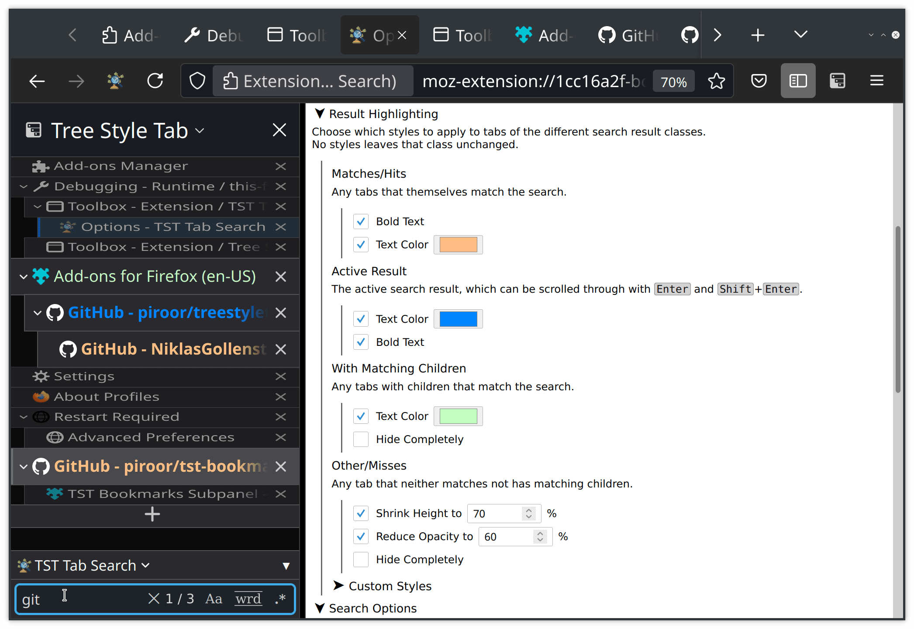
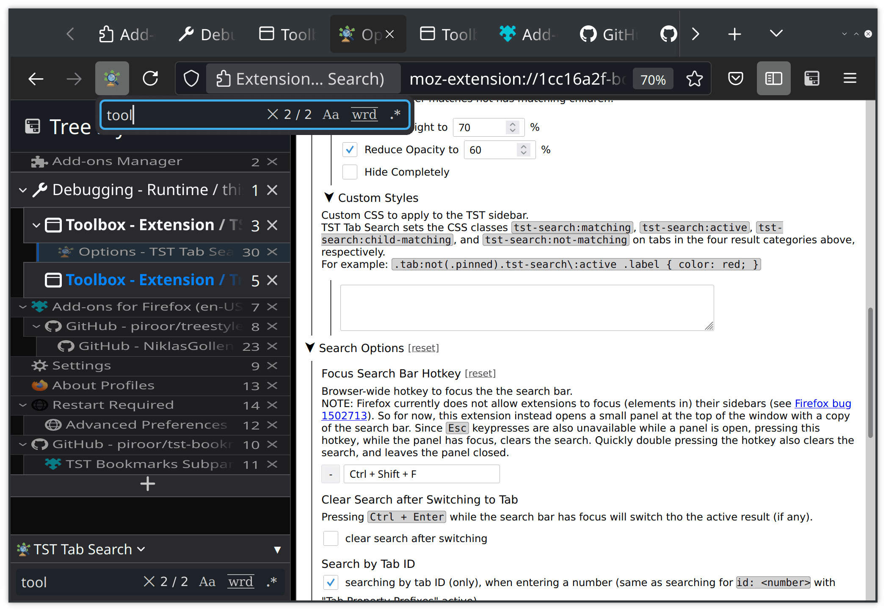
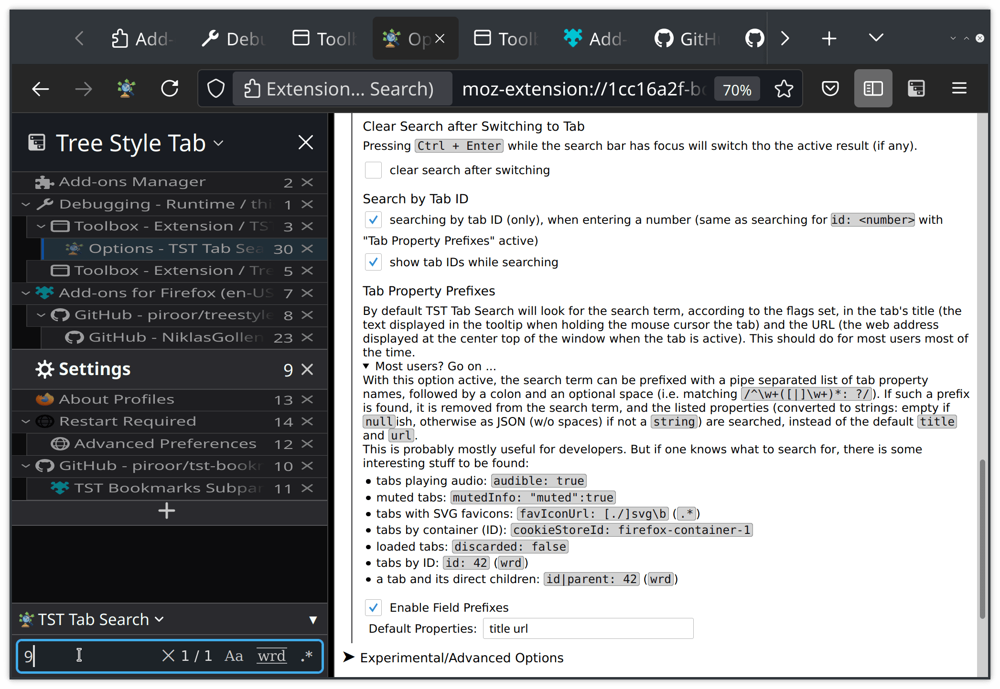
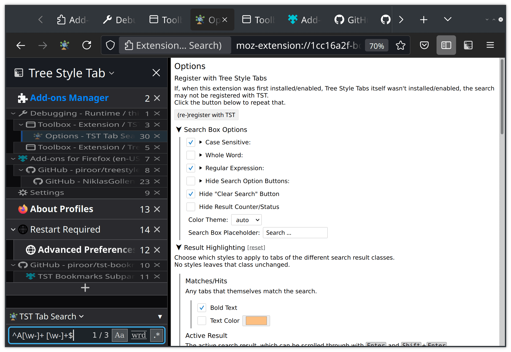

#  TST Tab Search -- filter Tree Style Tab's sidebar

<!-- AMO short description:
Search for or filter the Tabs in TST's sidebar, and quickly find and activate them.
-->

<!-- AMO long description: (AMO keeps line breaks, and supports a few HTML tags. Copy from here till the first MarkDown heading, but do remove the image tags.) -->

This is an extension for the browser extension <a href="https://github.com/piroor/treestyletab#readme">Tree Style Tabs</a> (TST). It adds a search box to TST's sidebar, allowing to search the tabs in the current window. With TST Tab Search you can: <ul>
    <li> start searching with a global search hotkey (Ctrl+Shift+F) </li>
    <li> customize the filtered tabs and the search panel </li>
    <li> cycle through results and then switch to the tabs </li>
    <li> search case sensitive, as whole word, or by regular expression </li>
    <li> show and search by tab ID </li>
    <li> search by any tab property </li>
</ul>

 <!-- remove this for AMO -->
<!-- Left to right: global search hotkey, customized filters, and search by tab ID. -->

There are quite a lot of things that can, but don't need to, be changed in the extensions options. The descriptions of the options also explain how some of the more advanced search features work.
Should the search bar not show up after installing this extension, then have a look at the top of the options page as well.
The options can be opened by either going to `about:addons` > "Extensions" > "TST Tab Search" > "Preferences", or right clicking the icon at the top right of the browser > "Manage Extension" > "Preferences". Should the icon not be there, then right click any of the other icons, select "Customize Toolbar" (last entry) and look on that page.

Many thanks to TST's author <a href="https://github.com/piroor">piroor</a>, who has not only developed TST as a great standalone extension, but also designed a very good API for other extensions to interact and integrate with TST. With that, writing the initial version of this extension from scratch took only about two long afternoons (but refining it took a lot longer)

<b>Permissions Used</b>: <ul>
    <li> "Access to browser tabs": Get titles and URLs of tabs to be searched. </li>
    <li> "Display notifications to you": Notify when something went wrong, or right. </li>
</ul>

<b>Privacy / Disclaimer</b>: <ul><!--break--></ul>
This extension doesn't collect any data, nor does it directly or indirectly contact any entity outside the browser, nor does it anything that should be detectable by websites whatsoever.
This extension only momentarily changes how tabs are displayed in the sidebar, but does no persistent changes to them, and should thus also not be able to cause any (tab) data loss.

## Screenshots

Default view of search results in Firefox 89 (other screenshots have customized options).

Highlighting search results in bold orange, the currently selected result in bold blue, and parents of search results in green.
All other tabs are shrunk and dimmed.
Pressing Ctrl+Enter will switch to the blue tab.

The global hotkey allows searching (and then switching to) tabs without moving the cursor. For technical reasons, the search panel has to open in the little popup at the top.

There is an option to display the tab IDs while the search panel is focused, to the quickly switch to tabs by id.

Additional search modes: case sensitive, as whole word, or by regular expression.
By default tab titles and URLs are searched, but there is an option to search all other (tree style) tab properties as well.

## Additional Features

I am happy to receive feedback or contributions on this. This is the list of stuff that should be addressed:

* Nothing on the agenda for now. Feel free to [suggest something](https://github.com/NiklasGollenstede/tst-search/issues).

## Development builds -- 

Development builds are automatically created on every commit with [appveyor](https://ci.appveyor.com/project/NiklasGollenstede/tst-search/history) and [released](https://github.com/NiklasGollenstede/tst-search/releases) on GitHub.\
To install them, go to [releases](https://github.com/NiklasGollenstede/tst-search/releases), under `Latest release` > "Assets" click `*-an.fx.xpi`, click allow and install; they will then update automatically.

These builds use a different id (`-dev` suffix), so they are installed as a separate extension (from the release version) and do not replace it upon installation. This means that:
 * you probably want to disable the release version while the development version is active, and vice versa
 * any options set are managed individually (so pre-release versions can't mess with your settings)
 * they never update to release versions, but
    * they update themselves to the latest development version (once a day, or when clicking `about:addons` > ⚙ > "Check for Updates")
        * privacy notice this sends an anonymous version request to a private server (which doesn't currently log it)
    * every release version has a corresponding development version (the one with the same prefix and highest build number)

##  AMO code review notes

Each [development build](#development-builds) also builds a release ZIP/XPI. For any given SemVer, the one of the tag with the highest build number will be manually uploaded to AMO as the release of that version (i.e., after a release, at least the patch version of any future builds is incremented).
The instructions for and logs of that tag's build show exactly how the release version was built.
Input to the build are source files, either from this repository or the extracted XPI, and files installed in `node_modules/` by `npm` as specified in `package.json` and `package-lock.json`.
Currently, the build process only builds some non-source files, updates the import paths, and ZIPs the required files.
