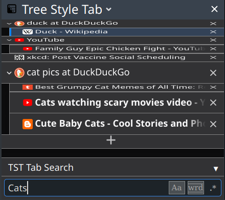

# TST Tab Search -- filter Tree Style Tab's sidebar

This is an extension for the browser extension [Tree Style Tabs](https://github.com/piroor/treestyletab#readme) (TST). It adds a search box at the bottom of TST's sidebar, allowing to search the titles of the tabs in the current window/sidebar, optionally case sensitive, as whole word, or by regular expression.
Matching tabs will be highlighted in the tree, and/or non-matches will be suppressed.

Thats pretty much all there is to say. Might add a few more highlight options.
Many thanks to TST's author [piroor](https://github.com/piroor), who has not only developed TST as a great standalone extension, but also designed a very good API for other extensions to interact and integrate with TST. With that, writing the initial version of this extension from scratch took only about to long afternoons.

<b>Permissions used</b>:

- "Display notifications to you": Tell you when something goes wrong, (so you should never see this ;) ).
- "Access to browser tabs" (manually granted via TST): Search titles of tabs.

<!-- NOTE: AMO keeps line breaks within paragraphs ... -->

## Development builds -- 

Development builds are automatically created on every commit with [appveyor](https://ci.appveyor.com/project/NiklasGollenstede/tst-search/history) and [released](https://github.com/NiklasGollenstede/tst-search/releases) on GitHub.\
These builds use a different id (`-dev` suffix), so they are installed as an additional extension and do not replace the release version. This means that:
 * you probably want to disable the release version while the development version is active
 * any options set are managed individually (so pre-release versions can't mess with your settings)
 * they never update to release versions, but
    * they update themselves to the latest development version
    * every release version has a corresponding development version (the one with the same prefix and highest build number)

##  AMO code review notes

Each [development build](#development-builds) also builds a release ZIP/XPI. For any given SemVer, the one from the tag with the highest build number will be manually uploaded to AMO as the release of that version.
The instructions for and logs of that tag show exactly how the release version was built.
Input to the build are source files from this repository, and files installed in `node_modules/` by `npm` as specified in `package.json` and `package-lock.json`.
Currently, the build process only builds some non-source files and ZIPs the required files.
